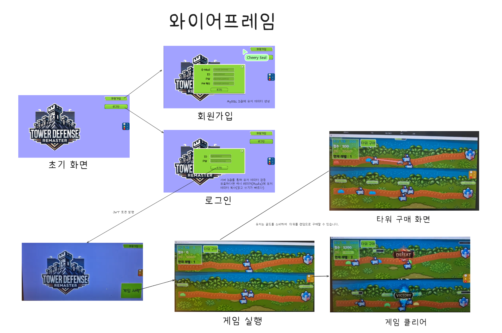
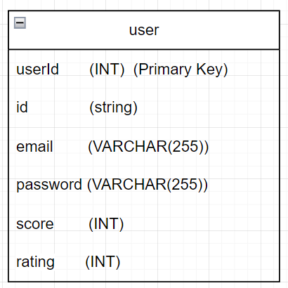

# 1. Architecture


# 2. Directory 

## 2-1. server 

<details>
<summary>구조</summary>
 
```
📦src
 ┣ 📂classes
 ┃ ┣ 📂managers
 ┃ ┃ ┣ 📜interval.manager.js
 ┃ ┃ ┣ 📜monster.manager.js
 ┃ ┃ ┗ 📜tower.manager.js
 ┃ ┗ 📂models
 ┃ ┃ ┣ 📜game.class.js
 ┃ ┃ ┣ 📜monster.class.js
 ┃ ┃ ┣ 📜tower.class.js
 ┃ ┃ ┗ 📜user.class.js
 ┣ 📂config
 ┃ ┗ 📜config.js
 ┣ 📂constants
 ┃ ┣ 📜env.js
 ┃ ┗ 📜header.js
 ┣ 📂db
 ┃ ┣ 📂migration
 ┃ ┃ ┗ 📜createSchemas.js
 ┃ ┣ 📂sql
 ┃ ┃ ┗ 📜user_db.sql
 ┃ ┣ 📂user
 ┃ ┃ ┣ 📜user.db.js
 ┃ ┃ ┗ 📜user.queries.js
 ┃ ┗ 📜database.js
 ┣ 📂events
 ┃ ┣ 📜onConnection.js
 ┃ ┣ 📜onData.js
 ┃ ┣ 📜onEnd.js
 ┃ ┗ 📜onError.js
 ┣ 📂handlers
 ┃ ┣ 📂game
 ┃ ┃ ┣ 📜monsterAttackBase.handler.js
 ┃ ┃ ┣ 📜monsterDeath.handler.js
 ┃ ┃ ┣ 📜purchaseTower.handler.js
 ┃ ┃ ┣ 📜spawnMonster.handler.js
 ┃ ┃ ┗ 📜towerAttack.handler.js
 ┃ ┣ 📂title
 ┃ ┃ ┣ 📜match.handler.js
 ┃ ┃ ┣ 📜singIn.handler.js
 ┃ ┃ ┗ 📜singUp.handler.js
 ┃ ┗ 📜index.js
 ┣ 📂init
 ┃ ┣ 📜index.js
 ┃ ┗ 📜loadProtos.js
 ┣ 📂protobuf
 ┃ ┣ 📜common.proto
 ┃ ┣ 📜packetNames.js
 ┃ ┗ 📜towerDefense.proto
 ┣ 📂session
 ┃ ┣ 📜game.session.js
 ┃ ┣ 📜session.js
 ┃ ┗ 📜user.session.js
 ┣ 📂utils
 ┃ ┣ 📂db
 ┃ ┃ ┗ 📜testConnection.js
 ┃ ┣ 📂error
 ┃ ┃ ┣ 📜customError.js
 ┃ ┃ ┣ 📜errorCodes.js
 ┃ ┃ ┗ 📜errorHandler.js
 ┃ ┣ 📂notification
 ┃ ┃ ┗ 📜game.notification.js
 ┃ ┣ 📂parser
 ┃ ┃ ┗ 📜packetParser.js
 ┃ ┣ 📂response
 ┃ ┃ ┗ 📜createResponse.js
 ┃ ┗ 📜dateFomatter.js
 ┗ 📜server.js
```

</details>


## 2-2. Client update

### GameManager.cs (Line 209) - comment

```
towers.Last().towerId = towerId;
```

### tower.cs 파일 (Line 43) - Added

```
if (monster.nowHp <= 0) return;
```
### GameManager.cs (Line 133) - Changed

```
Util.Random(5, roads1.Count - 5);
```

### GameManager.cs (Line 193) - Changed

```
var position = roads1[rand].transform.localPosition + new Vector3(0, Util.Random(-100, 100));
```

# 3. Project Introduction

## 3-1. 와이어 프레임


## 3-2. ERD


## 3-2. Packet


# 4. Tech Stack
[](https://skillicons.dev)


# 5. 구현 기능

<details>
<summary>패킷(공통)</summary>

1. 직렬화(createResponse)
    - 클라이언트로 전달할 헤더와 페이로드를 직렬화 처리 하는 기능입니다.
    - Paylaod는 oneof문법을 사용합니다.
2. 역질렬화(packetParser)
    - 클라이언트에서 받은 패킷을 헤더와 페이로드로 분리하는 기능이며, packetType, sequence, payload, offset을 반환합니다. 

</details>

<details>
<summary>몬스터</summary>

1. 생성
    - 클라이언트에서 몬스터 리스폰을 요청하면, 서버는 해당 클라이언트에 응답하고 같은 세션에 있는 클라이언트들에게 몬스터 스폰을 브로드캐스트합니다.
    - 브로드캐스트를 통해 서버와 클라이언트는 동일한 몬스터 배열을 가지게 됩니다.
  
      <details>
      <summary>예시</summary>
    
        ```
        📦 서버 
         ┣ 📂세션 1  = (몬스터 배열 : 10)
         ┃  ┣📜클라이언트 1 = (몬스터 배열 : 10)
         ┃  ┗📜클라이언트 2 = (몬스터 배열 : 10)
         ┣ 📂세션 2 = (몬스터 배열 : 7)
         ┃  ┣📜클라이언트 1 = (몬스터 배열 : 7)
         ┃  ┗📜클라이언트 2 = (몬스터 배열 : 7)
        
        ```
      </details>
2. 사망
  - 클라이언트에서 몬스터 죽음을 요청하면, 서버는 해당 클라이언트에 응답하고 같은 세션에 있는 클라이언트들에게 몬스터 삭제를 브로드캐스트합니다.
  - 브로드캐스트를 통해 서버와 클라이언트는 동일한 몬스터 배열을 가지게 됩니다.
3. 관리
  - 몬스터를 세션마다 생성, 검색, 삭제를 관리하는 매니저입니다.
    1. addMonster : 클라이언트 기준으로 몬스터를 랜덤하게 생성합니다
    2. getMonstersArr : 현재 세션에 있는 몬스터를 "배열" 형태로 반환합니다.
    3. getLastMonster : 마지막 몬스터 정보를 반환합니다.
    4. getMonstersMap : 현재 세션에 있는 몬스터를 "맵" 형태로 반환합니다.
    5. removeMonster : 세션에 있는 몬스터를 삭제합니다.
</details>

<details> 
<summary>황윤석 (몬스터)</summary>  
</details>

<details>
<summary>최슬기</summary>

## 전투 핸들러 및 이벤트 알림 패킷 구현

### monsterAttackBase 핸들러/updateBaseHP 패킷/gameOver 패킷


#### 주요 코드

```js
export const monsterAttackBaseHandler = async (socket, payload) => {
  const { damage } = payload;

  // 소켓을 통해 유저 객체 불러오기
  const user = getUserBySocket(socket);
  if (!user) {
    throw new CustomError(ErrorCodes.USER_NOT_FOUND, '유저를 찾을 수 없습니다.');
  }

  // 유저를 통해 게임 세션 불러오기
  const gameId = user.getGameId();
  const session = getGameSession(gameId);
  if (!session) return;

  user.baseHp -= damage;
  if (user.baseHp <= 0) {
    user.baseHp = 0;
  }

  // S2CUpdateBaseHPNotification 패킷을 나와 상대방에게 전송하기
  const dataToMe = { isOpponent: false, baseHp: user.baseHp };
  const dataToOpponent = { isOpponent: true, baseHp: user.baseHp };

  const packetToMe = updateBaseHPNotification(dataToMe, socket);
  const packetToOpponent = updateBaseHPNotification(dataToOpponent, socket);

  socket.write(packetToMe);
  session.broadcast(packetToOpponent, socket);

  // 내 baseHp가 0보다 작아졌다면 상대방에게 승리 패킷 보내기
  if (user.baseHp === 0) {
    // 유저를 통해 상대방 객체 불러오기
    const opponent = user.getOpponent();

    // 유저의 DB 데이터와 최고 기록
    const userHighestScore = user.highScore;

    // 상대방의 DB 데이터와 최고 기록
    const opponentHighestScore = opponent.highScore;

    const loseToMe = { isWin: false };
    const winToOpponent = { isWin: true };

    const losePacketToMe = gameOverNotification(loseToMe, socket);
    const winPacketToOpponent = gameOverNotification(winToOpponent, socket);

    socket.write(losePacketToMe);
    session.broadcast(winPacketToOpponent, socket);

    gameEnd(userHighestScore, opponentHighestScore, user, opponent, gameId, session);
  }
};
```

### towerAttack 핸들러


#### 주요코드

```js
export const towerAttackHandler = (socket, payload) => {
  const { towerId, monsterId } = payload;

  // 소켓을 통해 유저 객체 불러오기
  const user = getUserBySocket(socket);
  if (!user) {
    throw new CustomError(ErrorCodes.USER_NOT_FOUND, '유저를 찾을 수 없습니다.');
  }

  // 유저를 통해 게임 세션 불러오기
  const gameId = user.getGameId();
  const session = getGameSession(gameId);
  if (!session) return;

  // towerId, monsterId가 유효한지 검증
  // 1. 해당 타워를 사용자가 소유 중인가?
  const tower = session.checkIsTowerOwner(socket, towerId);
  if (!tower) {
    throw new CustomError(ErrorCodes.INVALID_PACKET, '사용자가 보유 중인 타워가 아닙니다.');
  }

  // 2. 몬스터가 세션에 존재하는가?
  const monster = user.monsters.find((monster) => monster.monsterId === monsterId);
  if (!monster) {
    throw new CustomError(ErrorCodes.INVALID_PACKET, '세션에 존재하지 않는 몬스터입니다.');
  }
  if (monster.getMonsterHp() <= 0) return;

  // 검증을 통과했다면 몬스터의 체력 감소
  monster.setMonsterHp(-config.ingame.towerPower);

  const packet = enemyTowerAttackNotification(payload, socket);
  session.broadcast(packet, socket);
};
```

### checkGameEnd 인터벌 함수


```js
async checkGameEnd() {
	const now = Date.now();

	this.users.forEach(async (user, socket, map) => {
		const elapsedTime = now - this.getTime();
		const userHighestScore = user.highScore;

		if (elapsedTime >= 80000) {
			const winToMe = { isWin: true };

			const winPacketToMe = gameOverNotification(winToMe, socket);

			socket.write(winPacketToMe);

			if (user.score > userHighestScore) {
				user.setHighScore(user.score);
				await updateUserScore(user.score, user.id);
			}

			removeGameSession(this.id); // 게임 세션 삭제
			this.intervalManager.clearAll(); // 모든 인터벌 제거

			// 유저들의 객체를 초기화
			user.resetUser();
		}
	});
}
```

</details>

<details>
<summary>한윤재</summary>
### 상태 동기화

1. 게임 클래스는 인터벌 매니저를 가지고 있습니다.

```js
class Game {
constructor() {
    this.intervalManager = new IntervalManager();
}

// ...
}
```

2. 방의 정원이 다 차서 게임을 시작할 때 게임 내의 모든 유저에게 상태 동기화 인터벌을 추가합니다. 클라이언트가 로드 된 후 동기화를 하기 위해 1초의 시간 텀을 두고 인터벌을 시작합니다.

```js
matchStartNotification() {
    for (var [socket, user] of this.users) {
    try {

        // ...

        setTimeout(
        (user, socket) => {
            console.log('timeout :', user.id);
            this.intervalManager.addPlayer(socket, user.syncStateNotification.bind(user), 100);
        },
        1000,
        user,
        socket,
        );
    } catch (error) {
        console.log(error);
    }
    }
    // ...
}
```

3. 게임을 끝낼 때 인터벌 매니저의 모든 인터벌을 삭제합니다.

```js
removeUser(socket) {
    // ...
    if (this.users.size === 1) {
    // ...
    removeGameSession(this.id); // 게임 세션 삭제
    this.intervalManager.clearAll(); // 모든 인터벌 제거
    // ...
    }
    // ...
}
```

```js
checkGameEnd() {
    // ...
    this.users.forEach(async (user, socket, map) => {
    // ...
    if (elapsedTime >= 80000) {
        // ...
        removeGameSession(this.id); // 게임 세션 삭제
        this.intervalManager.clearAll(); // 모든 인터벌 제거
        // ...
    }
    });
}
```

</details>

<details>
<summary>박찬일</summary>

1. 매치메이킹 핸들러 처리
* 유저가 매치메이킹을 요청하면 게임 세션에 유저를 추가한다. 게임 세션에 인원이 충분히 모이면 세션의 모든 유저들에게 게임 시작 패킷을 보낸다.
2. 매치메이킹 레이트 시스템(elo ranking system)
* 유저 매치시 elo점수에 따라 최대한 비슷한 유저끼리 매칭을 시도한다. 매치 종료 후, 두 유저의 elo점수에 따라 승점을 부여한다.
</details>


# 트러블 슈팅

## 2-1. 프로토버퍼 자료형 문제
1. 문제 : packetParser를 위해 공통 버퍼를 프로토 파일에 정의하고 사용하는 과정에서 발생.
2. 원인 : 프로토버퍼에는 ushort와 ubyte 자료형이 존재하지 않음.
3. 해결 : 공통 버퍼를 프로토 파일에 정의하지 않고, 직접 헤더와 페이로드를 분리하여 사용.

## 2-2. packetParser의 페이로드 역직렬화 문제
1. 문제 : 패킷 이름으로 정의한 이름을 사용해 역직렬화하니 페이로드가 제대로 역직렬화되지 않는 문제가 발생.
2. 원인 : 클라이언트에서 oneof 방식으로 직렬화하여 발생한 문제.
3. 해결 : 서버에서도 oneof 방식으로 역직렬화하여 문제를 해결.

## 2-3. createResponse의 페이로드 부분만 외부에서 직렬화했을 때 발생한 문제
1. 문제 : 각 핸들러에서 페이로드를 불필요하게 직렬화하여 코드가 늘어남.
2. 원인 : createResponse의 내부에서 페이로드 부분만 직렬화하지 않아서 발생.
3. 해결 : createResponse의 내부에서 oneof 방식으로 동적으로 페이로드를 직렬화하도록 변경.

## 2-4. GamePacket 프로토의 oneof 문법을 이해하고 적응하는데 시간이 들었다.
   https://protobuf.dev/programming-guides/proto3/#oneof
## 2-5. 
for문 안에서 setTimeout 비동기 함수를 사용해서 의도한대로 작동하지 않는 문제가 있었다. setTimeout 함수의 콜백 함수에서 실행에 필요한 매개변수를 받아서 해결했다.
## 2-6. 
db에 raw query를 보낼 때, 한번에 둘 이상의 UPDATE문을 실행하면 오류가 발생한다. 그래서 elo 랭킹을 업데이트 할 때, 두 유저의 레이팅을 동시에 업데이트 해야 하는데 TRANSACTION을 사용할 수 없었다.


상태 동기화 구현 중 인터벌 추가에서 문제가 생겼습니다.

1. 인터벌 추가 시기 문제
    - 문제
        -  클라이언트가 게임 에셋을 로드하고 게임을 시작하기 전에 이미 상태 동기화를 시작해서 에러가 나는 현상이 나타났습니다.
    - 해결
        - 1초 뒤 인터벌 추가를 해서 에러가 나지 않도록 방지했습니다.
2. setTimeOut 화살표 함수 문제
    - 문제
        -  for문으로 유저를 순회해서 인터벌을 추가하는데, 화살표 함수의 경우 이전 user와 socket 값을 저장하지 않아서 가장 마지막에 추가한 user와 socket을 중복해서 저장했습니다. 이 때문에 두 유저 중 한 명의 점수만 오르는 문제가 발생했습니다.
    - 해결
        - 따라서 함수의 매개변수에 user와 socket을 담아 각 변수의 값을 저장할 수 있도록 했습니다.

# 소감

# 3. 프로젝트 소감.
1. 프로토버퍼를 이용한 TCP 통신에 대해 좀 더 익숙해졌습니다.
2. 현재 서버와 클라이언트 구조는 사실상 클라이언트가 대부분 처리하고, 서버는 응답만 하는 에코 서버에 가까운 구조입니다. 이러한 방식의 문제점을 알게 되었고, 많은 것을 배울 수 있었던 팀 프로젝트였습니다.

# 4. 보완했으면 좋았을 점
1. 서버 역할 확장
- 서버가 게임 상태를 더 많이 관리하고, 클라이언트는 단순히 명령만 요청하는 구조로 설계했으면 좋았을 것 같습니다.
- 예를 들어, 서버가 게임의 "싱글 소스 오브 트루스(Single Source of Truth)" 역할을 맡아 데이터를 중앙에서 관리하면 더 안정적이고 효율적인 시스템이 될 것입니다.
- **Single Source of Truth (SSOT)**
- 시스템에서 데이터를 한 곳에서만 관리하고, 모든 다른 요소가 이 데이터를 참조하도록 설계하는 원칙.

2. 테스트와 성능 개선
- 클라이언트 수가 많아질 경우 브로드캐스트 성능에 저하가 발생할 수 있습니다.
- 비동기 처리나 이벤트 기반 구조를 도입해 부하를 분산하는 방법을 연구해보면 좋을 것 같습니다.

3. 로그 시스템 도입
- 이번 프로젝트에서 다양한 핸들러가 생겼는데, 이를 기반으로 서버/클라이언트에서 동작을 추적하는 로깅 시스템을 도입했으면 좋았을 것 같습니다.
- 이를 통해 디버깅과 유지보수의 난이도가 낮아질 것입니다.