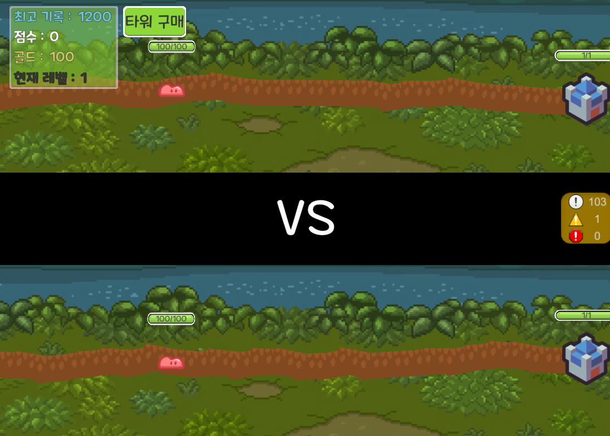
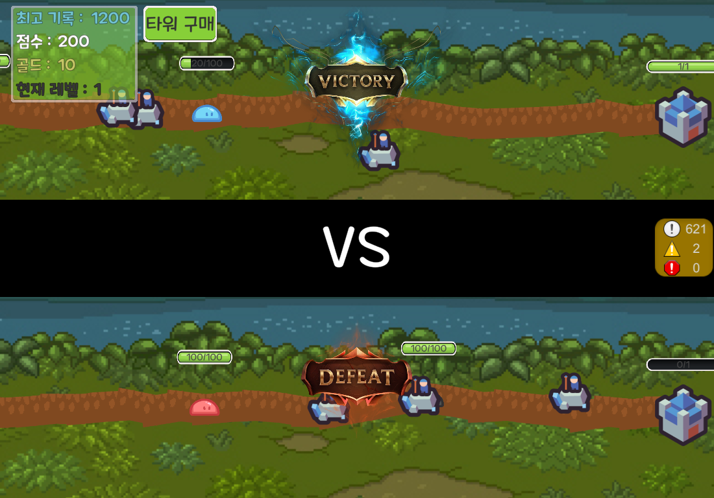

## 게임 소개
멀티(2인) 대전 타워 디펜스 게임 입니다. 귀여운 슬라임이 기지를 공격하러 다가옵니다. 타워를 구매하여 몬스터로부터 타워를 지켜내야합니다. 기지 체력이 상대방보다 먼저 0이되면 패배하게 되며 일정 시간동안 대전이 끝나지 않으면 높은 점수를 획득한 플레이어가 승리하게 됩니다. 




## Architecture


## Directory 

```
📦src
 ┣ 📂classes
 ┃ ┣ 📂managers
 ┃ ┃ ┣ 📜interval.manager.js
 ┃ ┃ ┣ 📜monster.manager.js
 ┃ ┃ ┗ 📜tower.manager.js
 ┃ ┗ 📂models
 ┃ ┃ ┣ 📜game.class.js
 ┃ ┃ ┣ 📜monster.class.js
 ┃ ┃ ┣ 📜tower.class.js
 ┃ ┃ ┗ 📜user.class.js
 ┣ 📂config
 ┃ ┗ 📜config.js
 ┣ 📂constants
 ┃ ┣ 📜env.js
 ┃ ┗ 📜header.js
 ┣ 📂db
 ┃ ┣ 📂migration
 ┃ ┃ ┗ 📜createSchemas.js
 ┃ ┣ 📂sql
 ┃ ┃ ┗ 📜user_db.sql
 ┃ ┣ 📂user
 ┃ ┃ ┣ 📜user.db.js
 ┃ ┃ ┗ 📜user.queries.js
 ┃ ┗ 📜database.js
 ┣ 📂events
 ┃ ┣ 📜onConnection.js
 ┃ ┣ 📜onData.js
 ┃ ┣ 📜onEnd.js
 ┃ ┗ 📜onError.js
 ┣ 📂handlers
 ┃ ┣ 📂game
 ┃ ┃ ┣ 📜monsterAttackBase.handler.js
 ┃ ┃ ┣ 📜monsterDeath.handler.js
 ┃ ┃ ┣ 📜purchaseTower.handler.js
 ┃ ┃ ┣ 📜spawnMonster.handler.js
 ┃ ┃ ┗ 📜towerAttack.handler.js
 ┃ ┣ 📂title
 ┃ ┃ ┣ 📜match.handler.js
 ┃ ┃ ┣ 📜singIn.handler.js
 ┃ ┃ ┗ 📜singUp.handler.js
 ┃ ┗ 📜index.js
 ┣ 📂init
 ┃ ┣ 📜index.js
 ┃ ┗ 📜loadProtos.js
 ┣ 📂protobuf
 ┃ ┣ 📜common.proto
 ┃ ┣ 📜packetNames.js
 ┃ ┗ 📜towerDefense.proto
 ┣ 📂session
 ┃ ┣ 📜game.session.js
 ┃ ┣ 📜session.js
 ┃ ┗ 📜user.session.js
 ┣ 📂utils
 ┃ ┣ 📂db
 ┃ ┃ ┗ 📜testConnection.js
 ┃ ┣ 📂error
 ┃ ┃ ┣ 📜customError.js
 ┃ ┃ ┣ 📜errorCodes.js
 ┃ ┃ ┗ 📜errorHandler.js
 ┃ ┣ 📂notification
 ┃ ┃ ┗ 📜game.notification.js
 ┃ ┣ 📂parser
 ┃ ┃ ┗ 📜packetParser.js
 ┃ ┣ 📂response
 ┃ ┃ ┗ 📜createResponse.js
 ┃ ┗ 📜dateFomatter.js
 ┗ 📜server.js
```
## 개발 과정

### 와이어 프레임


### ERD


### Packet


### Tech Stack
[](https://skillicons.dev)


## 클라이언트 수정

### GameManager.cs (Line 209) - comment

```
towers.Last().towerId = towerId;
```

### tower.cs 파일 (Line 43) - Added

```
if (monster.nowHp <= 0) return;
```
### GameManager.cs (Line 133) - Changed

```
Util.Random(5, roads1.Count - 5);
```

### GameManager.cs (Line 193) - Changed

```
var position = roads1[rand].transform.localPosition + new Vector3(0, Util.Random(-100, 100));
```

## 구현 기능

### 패킷(공통)
1. 직렬화(createResponse)
    - 클라이언트로 전달할 헤더와 페이로드를 직렬화 처리 하는 기능입니다.
    - Paylaod는 oneof문법을 사용합니다.
2. 역질렬화(packetParser)
    - 클라이언트에서 받은 패킷을 헤더와 페이로드로 분리하는 기능이며, packetType, sequence, payload, offset을 반환합니다. 

### 인증
1. 회원가입
   - 아이디, 비밀번호, 이메일(형식 포함)의 넘어온 값에 이상이 없는지 확인 후 비밀번호는 bycript로 암호화 하여 DB에 저장.
2. 로그인
   - 클라이언트로 전달받은 아이디와 비밀번호를 DB에서 조회하여 확인 후 이상이 없는 경우 JWT토큰 생성 후 로그인 처리. (로그인 상태로 변경)
3. 시퀀스 세션
   - 사용자가 로그인 하기 전 클라이언트로 부터 전달 받은 시퀀스를 검증하기 위해 소켓 연결이되면 해당 세션 **Map**에 저장하여 관리한다.  
   - 로그인후에는 유저 세션에서 관리한다.

   1. 임시 관리용 시퀀스 Map 생성
       <details>
          <summary>코드</summary>
      
        ```js
        export const sequenceTempSessions = new Map();
        ```
       </details>

   2. 클라이언트와 TCP 연결이 되면 해당 Map에 추가
       <details>
       <summary>코드</summary>
   
       ```js
       export const onConnection = (socket) => {
         // 연결 시 임시Sequence 세션에 등록
         setSequenceSession(socket, 1);
      
         // ...
       };
       ```
      </details>
   
   3. 회원가입
       1. 시퀀스 세션에 해당 소켓의 시퀀스 정보가 있는지 체크를 한다.
       2. `로그인/비로그인`에 따라 관리 포인트가 달라 각 상황에 맞게 해당 세션을 통해 검증을 진행한다.
           - (비로그인) 시퀀스 세션의 값과 비교 하여 유효한 값인지 검증한다.
           - (로그인) 유저 세션에서 조회하여 검증을 진행한다.
       <details>
       <summary>코드</summary>
      
       ```js
       const singUpHandler = async (socket, payload, sequence) => {
    
         // 4. 임시 시퀀스 세션에서 시퀀스 유효여부 체크
         const tempSequence = getSequenceSession(socket);
         let nextSequence;
         if (tempSequence) {
           if (sequence !== tempSequence) {
             throw new CustomError(ErrorCodes.INVALID_SEQUENCE, '유효하지 않는 시퀀스 입니다.');
           }
           nextSequence = tempSequence + 1;
           // 임시 Sequnece세션에 업데이트
           setSequenceSession(socket, nextSequence);
         } else {
           const user = getUserBySocket(socket);
           if (!user) {
             throw new CustomError(ErrorCodes.USER_NOT_FOUND, '해당 유저를 찾을 수 없습니다.');
           }
           user.checkSequence(sequence);
           nextSequence = user.getNextSequence();
         }
    
       ```
       </details>
   4. 로그인
       1. 전달 받은 시퀀스의 값이 유효한지 검증을 한다.
       2. 이상이 없는 경우 유저 세션에 추가하고 시퀀스 번호를 기록한다.
       3. 로그인 후에는 유저 세션에서 시퀀스를 관리하기에 시퀀스 세션에서 해당 정보를 삭제한다.
         <details>
         <summary>코드</summary>
      
           ```js
           // 회원가입 Handler
           const singInHandler = async (socket, payload, sequence) => {
      
               // 임시 시퀀스 세션에서 시퀀스 유효여부 체크
               const tempSequence = getSequenceSession(socket);
               if (sequence !== tempSequence) {
                 throw new CustomError(ErrorCodes.INVALID_SEQUENCE, '유효하지 않는 시퀀스 입니다.');
               }
           };
   
           // 5. 유저 세션 추가 + DB에서 유저의 최고 기록 불러오기
           const userSession = addUser(socket, id, user.score, user.rating, sequence);

           // 임시 Sequnce세션에서 삭제
           removeSequenceSession(socket);
           ```
         </details>

       5. ErrorHandler(공통)
           - 서버 내에서 오류가 발생 했을 경우 시퀀스 번호를 강제적으로 검증 없이 현재 값에서 +1로 수정한다.
           <details>
             <summary>코드</summary>
         
           ```js
           export const handleError = (socket, error, packetType = null) => {
             // 시퀀스 처리
             const tempSequence = getSequenceSession(socket);
             if (tempSequence) {
               // 임시 시퀀스 세션
               setSequenceSession(socket, tempSequence + 1);
             } else {
               // 유저 세션 시퀀스
               const user = getUserBySocket(socket);
               if (!user) {
               user.updateNextSequence();
               }
             }
           };
           ``` 
         </details>

### 매칭
1. 유저가 매치메이킹을 요청하면 게임 세션에 유저를 추가한다. 게임 세션에 인원이 충분히 모이면 세션의 모든 유저들에게 게임 시작 패킷을 보낸다.
2. 매치메이킹 레이트 시스템(elo ranking system)
   - 유저 매치시 elo점수에 따라 최대한 비슷한 유저끼리 매칭을 시도한다. 매치 종료 후, 두 유저의 elo점수에 따라 승점을 부여한다.
   
### 몬스터
1. 생성
    - 클라이언트에서 몬스터 리스폰을 요청하면, 서버는 해당 클라이언트에 응답하고 같은 세션에 있는 클라이언트들에게 몬스터 스폰을 브로드캐스트합니다.
    - 브로드캐스트를 통해 서버와 클라이언트는 동일한 몬스터 배열을 가지게 됩니다.
  
      <details>
      <summary>예시</summary>
    
        ```
        📦 서버 
         ┣ 📂세션 1  = (몬스터 배열 : 10)
         ┃  ┣📜클라이언트 1 = (몬스터 배열 : 10)
         ┃  ┗📜클라이언트 2 = (몬스터 배열 : 10)
         ┣ 📂세션 2 = (몬스터 배열 : 7)
         ┃  ┣📜클라이언트 1 = (몬스터 배열 : 7)
         ┃  ┗📜클라이언트 2 = (몬스터 배열 : 7)
        
        ```
      </details>
2. 사망
  - 클라이언트에서 몬스터 죽음을 요청하면, 서버는 해당 클라이언트에 응답하고 같은 세션에 있는 클라이언트들에게 몬스터 삭제를 브로드캐스트합니다.
  - 브로드캐스트를 통해 서버와 클라이언트는 동일한 몬스터 배열을 가지게 됩니다.
3. 관리
  - 몬스터를 세션마다 생성, 검색, 삭제를 관리하는 매니저입니다.
    <details> 
    <summary>상세</summary>  

    1. addMonster : 클라이언트 기준으로 몬스터를 랜덤하게 생성합니다
    2. getMonstersArr : 현재 세션에 있는 몬스터를 "배열" 형태로 반환합니다.
    3. getLastMonster : 마지막 몬스터 정보를 반환합니다.
    4. getMonstersMap : 현재 세션에 있는 몬스터를 "맵" 형태로 반환합니다.
    5. removeMonster : 세션에 있는 몬스터를 삭제합니다.
   </details>
    
### 전투
1. 몬스터 공격
   
    - 클라이언트에서 몬스터가 기지에 닿았을 때 요청하게 되며, 기지의 체력을 감소 처리하고 결과를 본인과 상대방에게 전달한다.
    - 기지의 체력이 0이 되면 게임오버 패킷을 해당 게임 세션에 있는 플레이어들에게 결과를 알려준다.
        <details>
        <summary>코드</summary>
        
        ```js
        export const monsterAttackBaseHandler = async (socket, payload) => {
          const { damage } = payload;
        
          // 소켓을 통해 유저 객체 불러오기
          const user = getUserBySocket(socket);
          if (!user) {
            throw new CustomError(ErrorCodes.USER_NOT_FOUND, '유저를 찾을 수 없습니다.');
          }
        
          // 유저를 통해 게임 세션 불러오기
          const gameId = user.getGameId();
          const session = getGameSession(gameId);
          if (!session) return;
        
          user.baseHp -= damage;
          if (user.baseHp <= 0) {
            user.baseHp = 0;
          }
        
          // S2CUpdateBaseHPNotification 패킷을 나와 상대방에게 전송하기
          const dataToMe = { isOpponent: false, baseHp: user.baseHp };
          const dataToOpponent = { isOpponent: true, baseHp: user.baseHp };
        
          const packetToMe = updateBaseHPNotification(dataToMe, socket);
          const packetToOpponent = updateBaseHPNotification(dataToOpponent, socket);
        
          socket.write(packetToMe);
          session.broadcast(packetToOpponent, socket);
        
          // 내 baseHp가 0보다 작아졌다면 상대방에게 승리 패킷 보내기
          if (user.baseHp === 0) {
            // 유저를 통해 상대방 객체 불러오기
            const opponent = user.getOpponent();
        
            // 유저의 DB 데이터와 최고 기록
            const userHighestScore = user.highScore;
        
            // 상대방의 DB 데이터와 최고 기록
            const opponentHighestScore = opponent.highScore;
        
            const loseToMe = { isWin: false };
            const winToOpponent = { isWin: true };
        
            const losePacketToMe = gameOverNotification(loseToMe, socket);
            const winPacketToOpponent = gameOverNotification(winToOpponent, socket);
        
            socket.write(losePacketToMe);
            session.broadcast(winPacketToOpponent, socket);
        
            gameEnd(userHighestScore, opponentHighestScore, user, opponent, gameId, session);
          }
        };
        ```
        </details>

2. 타워 공격
   
   - 클라이언트에서 몬스터가 기지에 닿았을 때 요청하게 되며, 기지의 체력을 감소 처리하고 결과를 본인과 상대방에게 전달한다.
    <details>
    <summary>코드</summary>
    
    ```js
    export const towerAttackHandler = (socket, payload) => {
      const { towerId, monsterId } = payload;
    
    // 소켓을 통해 유저 객체 불러오기
    const user = getUserBySocket(socket);
    if (!user) {
    throw new CustomError(ErrorCodes.USER_NOT_FOUND, '유저를 찾을 수 없습니다.');
    }
    
    // 유저를 통해 게임 세션 불러오기
    const gameId = user.getGameId();
    const session = getGameSession(gameId);
    if (!session) return;
    
    // towerId, monsterId가 유효한지 검증
    // 1. 해당 타워를 사용자가 소유 중인가?
    const tower = session.checkIsTowerOwner(socket, towerId);
    if (!tower) {
    throw new CustomError(ErrorCodes.INVALID_PACKET, '사용자가 보유 중인 타워가 아닙니다.');
    }
    
    // 2. 몬스터가 세션에 존재하는가?
    const monster = user.monsters.find((monster) => monster.monsterId === monsterId);
    if (!monster) {
    throw new CustomError(ErrorCodes.INVALID_PACKET, '세션에 존재하지 않는 몬스터입니다.');
    }
    if (monster.getMonsterHp() <= 0) return;
    
    // 검증을 통과했다면 몬스터의 체력 감소
    monster.setMonsterHp(-config.ingame.towerPower);
    
    const packet = enemyTowerAttackNotification(payload, socket);
    session.broadcast(packet, socket);
    };
    ```
    </details>

3. 게임 시간
   
   - 매치가 성사되어 대전이 시작되면 checkGameEnd 인터벌 함수를 통해서 게임 시간을 체크하여 설정 시간이 지나면 강제로 대전을 종료시킨다.
    <details>
    <summary>코드</summary>
    
    ```js
    async checkGameEnd() {
        const now = Date.now();
    
        this.users.forEach(async (user, socket, map) => {
            const elapsedTime = now - this.getTime();
            const userHighestScore = user.highScore;
    
            if (elapsedTime >= 80000) {
                const winToMe = { isWin: true };
    
                const winPacketToMe = gameOverNotification(winToMe, socket);
    
                socket.write(winPacketToMe);
    
                if (user.score > userHighestScore) {
                    user.setHighScore(user.score);
                    await updateUserScore(user.score, user.id);
                }
    
                removeGameSession(this.id); // 게임 세션 삭제
                this.intervalManager.clearAll(); // 모든 인터벌 제거
    
                // 유저들의 객체를 초기화
                user.resetUser();
            }
        });
    }
    ```
    </details>

### 상태 동기화 
- 게임 클래스는 인터벌 매니저를 가지고 있습니다.
    <details>
    <summary>코드</summary>
  
    ```js
    class Game {
    constructor() {
        this.intervalManager = new IntervalManager();
    }
    
    // ...
    }
    ```
    </details>

- 방의 정원이 다 차서 게임을 시작할 때 게임 내의 모든 유저에게 상태 동기화 인터벌을 추가합니다. 클라이언트가 로드 된 후 동기화를 하기 위해 1초의 시간 텀을 두고 인터벌을 시작합니다.
<details>
<summary>코드</summary>

```js
matchStartNotification() {
    for (var [socket, user] of this.users) {
    try {

        // ...

        setTimeout(
        (user, socket) => {
            console.log('timeout :', user.id);
            this.intervalManager.addPlayer(socket, user.syncStateNotification.bind(user), 100);
        },
        1000,
        user,
        socket,
        );
    } catch (error) {
        console.log(error);
    }
    }
    // ...
}
```
</details>

3. 게임을 끝낼 때 인터벌 매니저의 모든 인터벌을 삭제합니다.
<details>
<summary>코드</summary>

```js
removeUser(socket) {
    // ...
    if (this.users.size === 1) {
    // ...
    removeGameSession(this.id); // 게임 세션 삭제
    this.intervalManager.clearAll(); // 모든 인터벌 제거
    // ...
    }
    // ...
}
```

```js
checkGameEnd() {
    // ...
    this.users.forEach(async (user, socket, map) => {
    // ...
    if (elapsedTime >= 80000) {
        // ...
        removeGameSession(this.id); // 게임 세션 삭제
        this.intervalManager.clearAll(); // 모든 인터벌 제거
        // ...
    }
    });
}
```
</details>

## 트러블 슈팅

### 1. 프로토버퍼 자료형 문제  
- 문제 : packetParser를 위해 공통 버퍼를 프로토 파일에 정의하고 사용하는 과정에서 발생.
- 원인 : 프로토버퍼에는 ushort와 ubyte 자료형이 존재하지 않음.
- 해결 : 공통 버퍼를 프로토 파일에 정의하지 않고, 직접 헤더와 페이로드를 분리하여 사용.

### 2. packetParser의 페이로드 역직렬화 문제
- 문제 : 패킷 이름으로 정의한 이름을 사용해 역직렬화하니 페이로드가 제대로 역직렬화되지 않는 문제가 발생.
- 원인 : 클라이언트에서 oneof 방식으로 직렬화하여 발생한 문제.
- 해결 : 서버에서도 oneof 방식으로 역직렬화하여 문제를 해결.

### 3. createResponse의 페이로드 부분만 외부에서 직렬화했을 때 발생한 문제
- 문제 : 각 핸들러에서 페이로드를 불필요하게 직렬화하여 코드가 늘어남.
- 원인 : createResponse의 내부에서 페이로드 부분만 직렬화하지 않아서 발생.
- 해결 : createResponse의 내부에서 oneof 방식으로 동적으로 페이로드를 직렬화하도록 변경.

### 4. DB 트랜잭션
- 문제 : raw query를 보낼 때, 한번에 둘 이상의 UPDATE문을 실행하면 오류가 발생하여 elo 랭킹을 업데이트 할 때, 두 유저의 레이팅을 동시에 업데이트 해야 하는데 TRANSACTION을 사용할 수 없었다.
- 원인 : query() 에서 실행 가능한 쿼리문은 1개만 가능하다는 것을 확인. 
- 해결 : 생성한 Pool의 커넥션 트랜잭션을 이용하여 처리.

### 5. 상태 동기화 구현 중 오류 발생.
1. 인터벌 추가 시기 문제
   - 배경 : 게임 시작시 오류 로그 발생
   - 문제 : 클라이언트가 게임 에셋을 로드하고 게임을 시작하기 전에 이미 상태 동기화를 시작해서 에러가 나는 현상을 확인.
   - 해결 : 1초 뒤 인터벌 추가를 해서 에러가 나지 않도록 방지.
2. setTimeOut 화살표 함수 문제
   - 배경 : 테스트 중 두 유저 중 한 명의 점수만 오르는 문제를 확인.
   - 문제 : for문으로 유저를 순회해서 인터벌을 추가하는데, 화살표 함수의 경우 이전 user와 socket 값을 저장하지 않아서 가장 마지막에 추가한 user와 socket을 중복해서 저장했습니다. 이 때문에 두 유저 중 한 명의 점수만 오르는 문제가 발생.
   - 해결 : 함수의 매개변수에 user와 socket을 담아 각 변수의 값을 저장할 수 있도록 처리.

## 회고
이번 프로젝트는 클라이언트 주도로 게임 로직이 진행되는 구조였고, 서버는 응답만 하는 에코 서버에 가까운 구조입니다. 그러다 보니 서버에서 클라이언트의 정보를 검증할 수 없었고 비정상적인 값을 보내도 서버는 이를 그대로 중계해야 했습니다. 이번 프로젝트를 통하여 이러한 방식의 문제점을 알 수 있었던 프로젝트 였습니다.
 
### 보완점
1. 서버 역할 확장
- 서버가 게임 상태를 더 많이 관리하고, 클라이언트는 단순히 명령만 요청하는 구조로 설계했으면 좋았을 것 같습니다.
- 예를 들어, 서버가 게임의 "싱글 소스 오브 트루스(Single Source of Truth)" 역할을 맡아 데이터를 중앙에서 관리하면 더 안정적이고 효율적인 시스템이 될 것입니다.
- **Single Source of Truth (SSOT)**
- 시스템에서 데이터를 한 곳에서만 관리하고, 모든 다른 요소가 이 데이터를 참조하도록 설계하는 원칙.

2. 테스트와 성능 개선
- 클라이언트 수가 많아질 경우 브로드캐스트 성능에 저하가 발생할 수 있습니다.
- 비동기 처리나 이벤트 기반 구조를 도입해 부하를 분산하는 방법을 연구해보면 좋을 것 같습니다.

3. 로그 시스템 도입
- 이번 프로젝트에서 다양한 핸들러가 생겼는데, 이를 기반으로 서버/클라이언트에서 동작을 추적하는 로깅 시스템을 도입했으면 좋았을 것 같습니다.
- 이를 통해 디버깅과 유지보수의 난이도가 낮아질 것입니다.

