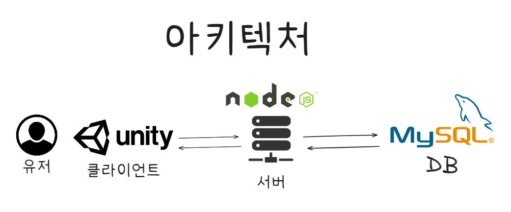
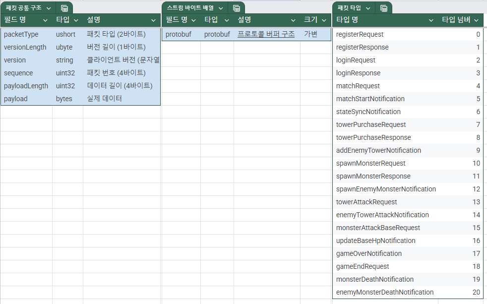
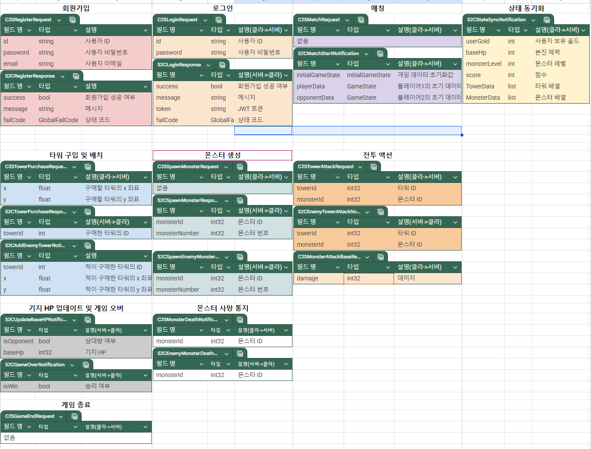
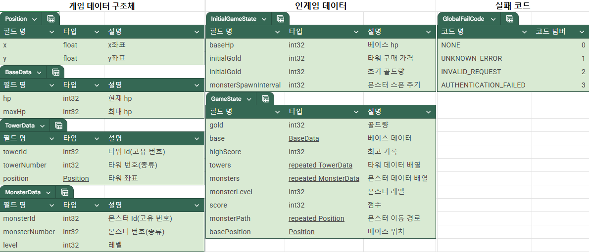

# 1. Architecture



# 2. Directory 

## 2-1. server 
```
📦src
 ┣ 📂classes
 ┃ ┣ 📂managers
 ┃ ┃ ┣ 📜interval.manager.js
 ┃ ┃ ┣ 📜monster.manager.js
 ┃ ┃ ┗ 📜tower.manager.js
 ┃ ┗ 📂models
 ┃ ┃ ┣ 📜game.class.js
 ┃ ┃ ┣ 📜monster.class.js
 ┃ ┃ ┣ 📜tower.class.js
 ┃ ┃ ┗ 📜user.class.js
 ┣ 📂config
 ┃ ┗ 📜config.js
 ┣ 📂constants
 ┃ ┣ 📜env.js
 ┃ ┗ 📜header.js
 ┣ 📂db
 ┃ ┣ 📂migration
 ┃ ┃ ┗ 📜createSchemas.js
 ┃ ┣ 📂sql
 ┃ ┃ ┗ 📜user_db.sql
 ┃ ┣ 📂user
 ┃ ┃ ┣ 📜user.db.js
 ┃ ┃ ┗ 📜user.queries.js
 ┃ ┗ 📜database.js
 ┣ 📂events
 ┃ ┣ 📜onConnection.js
 ┃ ┣ 📜onData.js
 ┃ ┣ 📜onEnd.js
 ┃ ┗ 📜onError.js
 ┣ 📂handlers
 ┃ ┣ 📂game
 ┃ ┃ ┣ 📜monsterAttackBase.handler.js
 ┃ ┃ ┣ 📜monsterDeath.handler.js
 ┃ ┃ ┣ 📜purchaseTower.handler.js
 ┃ ┃ ┣ 📜spawnMonster.handler.js
 ┃ ┃ ┗ 📜towerAttack.handler.js
 ┃ ┣ 📂title
 ┃ ┃ ┣ 📜match.handler.js
 ┃ ┃ ┣ 📜singIn.handler.js
 ┃ ┃ ┗ 📜singUp.handler.js
 ┃ ┗ 📜index.js
 ┣ 📂init
 ┃ ┣ 📜index.js
 ┃ ┗ 📜loadProtos.js
 ┣ 📂protobuf
 ┃ ┣ 📜common.proto
 ┃ ┣ 📜packetNames.js
 ┃ ┗ 📜towerDefense.proto
 ┣ 📂session
 ┃ ┣ 📜game.session.js
 ┃ ┣ 📜session.js
 ┃ ┗ 📜user.session.js
 ┣ 📂utils
 ┃ ┣ 📂db
 ┃ ┃ ┗ 📜testConnection.js
 ┃ ┣ 📂error
 ┃ ┃ ┣ 📜customError.js
 ┃ ┃ ┣ 📜errorCodes.js
 ┃ ┃ ┗ 📜errorHandler.js
 ┃ ┣ 📂notification
 ┃ ┃ ┗ 📜game.notification.js
 ┃ ┣ 📂parser
 ┃ ┃ ┗ 📜packetParser.js
 ┃ ┣ 📂response
 ┃ ┃ ┗ 📜createResponse.js
 ┃ ┗ 📜dateFomatter.js
 ┗ 📜server.js
```

# 3. Project Introduction

## 3-1. packet 








# 4. Tech Stack
[](https://skillicons.dev)


