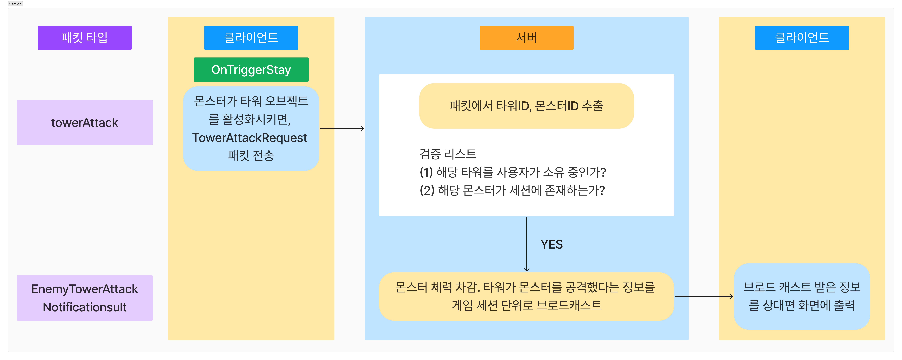
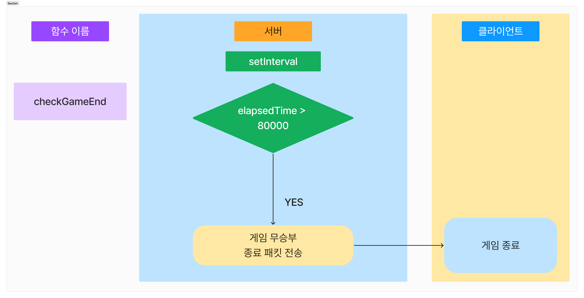

# 1. Architecture


# 2. Directory

## 2-1. server

<details>
 
```
📦src
 ┣ 📂classes
 ┃ ┣ 📂managers
 ┃ ┃ ┣ 📜interval.manager.js
 ┃ ┃ ┣ 📜monster.manager.js
 ┃ ┃ ┗ 📜tower.manager.js
 ┃ ┗ 📂models
 ┃ ┃ ┣ 📜game.class.js
 ┃ ┃ ┣ 📜monster.class.js
 ┃ ┃ ┣ 📜tower.class.js
 ┃ ┃ ┗ 📜user.class.js
 ┣ 📂config
 ┃ ┗ 📜config.js
 ┣ 📂constants
 ┃ ┣ 📜env.js
 ┃ ┗ 📜header.js
 ┣ 📂db
 ┃ ┣ 📂migration
 ┃ ┃ ┗ 📜createSchemas.js
 ┃ ┣ 📂sql
 ┃ ┃ ┗ 📜user_db.sql
 ┃ ┣ 📂user
 ┃ ┃ ┣ 📜user.db.js
 ┃ ┃ ┗ 📜user.queries.js
 ┃ ┗ 📜database.js
 ┣ 📂events
 ┃ ┣ 📜onConnection.js
 ┃ ┣ 📜onData.js
 ┃ ┣ 📜onEnd.js
 ┃ ┗ 📜onError.js
 ┣ 📂handlers
 ┃ ┣ 📂game
 ┃ ┃ ┣ 📜monsterAttackBase.handler.js
 ┃ ┃ ┣ 📜monsterDeath.handler.js
 ┃ ┃ ┣ 📜purchaseTower.handler.js
 ┃ ┃ ┣ 📜spawnMonster.handler.js
 ┃ ┃ ┗ 📜towerAttack.handler.js
 ┃ ┣ 📂title
 ┃ ┃ ┣ 📜match.handler.js
 ┃ ┃ ┣ 📜singIn.handler.js
 ┃ ┃ ┗ 📜singUp.handler.js
 ┃ ┗ 📜index.js
 ┣ 📂init
 ┃ ┣ 📜index.js
 ┃ ┗ 📜loadProtos.js
 ┣ 📂protobuf
 ┃ ┣ 📜common.proto
 ┃ ┣ 📜packetNames.js
 ┃ ┗ 📜towerDefense.proto
 ┣ 📂session
 ┃ ┣ 📜game.session.js
 ┃ ┣ 📜session.js
 ┃ ┗ 📜user.session.js
 ┣ 📂utils
 ┃ ┣ 📂db
 ┃ ┃ ┗ 📜testConnection.js
 ┃ ┣ 📂error
 ┃ ┃ ┣ 📜customError.js
 ┃ ┃ ┣ 📜errorCodes.js
 ┃ ┃ ┗ 📜errorHandler.js
 ┃ ┣ 📂notification
 ┃ ┃ ┗ 📜game.notification.js
 ┃ ┣ 📂parser
 ┃ ┃ ┗ 📜packetParser.js
 ┃ ┣ 📂response
 ┃ ┃ ┗ 📜createResponse.js
 ┃ ┗ 📜dateFomatter.js
 ┗ 📜server.js
```

</details>

## 2-2. Client update

### GameManager.cs (Line 209) - comment

```
towers.Last().towerId = towerId;
```

### tower.cs 파일 (Line 43) - Added

```
if (monster.nowHp <= 0) return;
```

### GameManager.cs (Line 133) - Changed

```
Util.Random(5, roads1.Count - 5);
```

### GameManager.cs (Line 193) - Changed

```
var position = roads1[rand].transform.localPosition + new Vector3(0, Util.Random(-100, 100));
```

# 3. Project Introduction

## 3-1. packet


## 전투 핸들러 및 이벤트 알림 패킷 구현

### monsterAttackBase 핸들러/updateBaseHP 패킷/gameOver 패킷


#### 주요 코드

```js
export const monsterAttackBaseHandler = async (socket, payload) => {
  const { damage } = payload;

  // 소켓을 통해 유저 객체 불러오기
  const user = getUserBySocket(socket);
  if (!user) {
    throw new CustomError(ErrorCodes.USER_NOT_FOUND, '유저를 찾을 수 없습니다.');
  }

  // 유저를 통해 게임 세션 불러오기
  const gameId = user.getGameId();
  const session = getGameSession(gameId);
  if (!session) return;

  user.baseHp -= damage;
  if (user.baseHp <= 0) {
    user.baseHp = 0;
  }

  // S2CUpdateBaseHPNotification 패킷을 나와 상대방에게 전송하기
  const dataToMe = { isOpponent: false, baseHp: user.baseHp };
  const dataToOpponent = { isOpponent: true, baseHp: user.baseHp };

  const packetToMe = updateBaseHPNotification(dataToMe, socket);
  const packetToOpponent = updateBaseHPNotification(dataToOpponent, socket);

  socket.write(packetToMe);
  session.broadcast(packetToOpponent, socket);

  // 내 baseHp가 0보다 작아졌다면 상대방에게 승리 패킷 보내기
  if (user.baseHp === 0) {
    // 유저를 통해 상대방 객체 불러오기
    const opponent = user.getOpponent();

    // 유저의 DB 데이터와 최고 기록
    const userHighestScore = user.highScore;

    // 상대방의 DB 데이터와 최고 기록
    const opponentHighestScore = opponent.highScore;

    const loseToMe = { isWin: false };
    const winToOpponent = { isWin: true };

    const losePacketToMe = gameOverNotification(loseToMe, socket);
    const winPacketToOpponent = gameOverNotification(winToOpponent, socket);

    socket.write(losePacketToMe);
    session.broadcast(winPacketToOpponent, socket);

    gameEnd(userHighestScore, opponentHighestScore, user, opponent, gameId, session);
  }
};
```

### towerAttack 핸들러



#### 주요코드

```js
export const towerAttackHandler = (socket, payload) => {
  const { towerId, monsterId } = payload;

  // 소켓을 통해 유저 객체 불러오기
  const user = getUserBySocket(socket);
  if (!user) {
    throw new CustomError(ErrorCodes.USER_NOT_FOUND, '유저를 찾을 수 없습니다.');
  }

  // 유저를 통해 게임 세션 불러오기
  const gameId = user.getGameId();
  const session = getGameSession(gameId);
  if (!session) return;

  // towerId, monsterId가 유효한지 검증
  // 1. 해당 타워를 사용자가 소유 중인가?
  const tower = session.checkIsTowerOwner(socket, towerId);
  if (!tower) {
    throw new CustomError(ErrorCodes.INVALID_PACKET, '사용자가 보유 중인 타워가 아닙니다.');
  }

  // 2. 몬스터가 세션에 존재하는가?
  const monster = user.monsters.find((monster) => monster.monsterId === monsterId);
  if (!monster) {
    throw new CustomError(ErrorCodes.INVALID_PACKET, '세션에 존재하지 않는 몬스터입니다.');
  }
  if (monster.getMonsterHp() <= 0) return;

  // 검증을 통과했다면 몬스터의 체력 감소
  monster.setMonsterHp(-config.ingame.towerPower);

  const packet = enemyTowerAttackNotification(payload, socket);
  session.broadcast(packet, socket);
};
```

### checkGameEnd 인터벌 함수



```js
async checkGameEnd() {
	const now = Date.now();

	this.users.forEach(async (user, socket, map) => {
		const elapsedTime = now - this.getTime();
		const userHighestScore = user.highScore;

		if (elapsedTime >= 80000) {
			const winToMe = { isWin: true };

			const winPacketToMe = gameOverNotification(winToMe, socket);

			socket.write(winPacketToMe);

			if (user.score > userHighestScore) {
				user.setHighScore(user.score);
				await updateUserScore(user.score, user.id);
			}

			removeGameSession(this.id); // 게임 세션 삭제
			this.intervalManager.clearAll(); // 모든 인터벌 제거

			// 유저들의 객체를 초기화
			user.resetUser();
		}
	});
}
```

# 4. Tech Stack

[](https://skillicons.dev)


